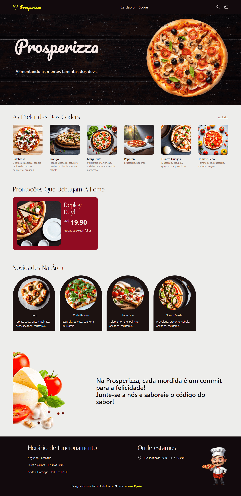
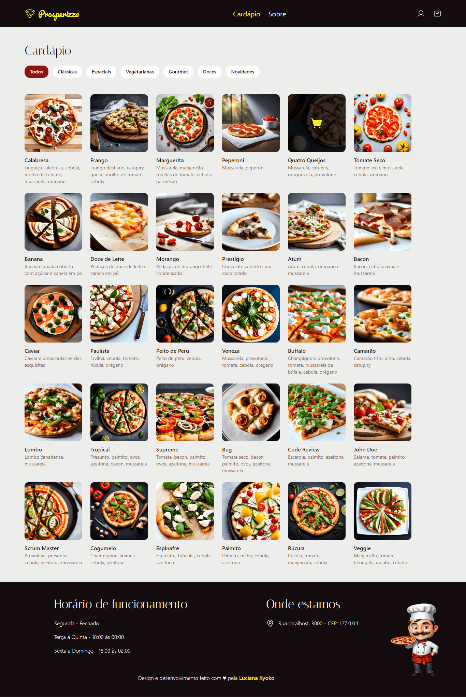
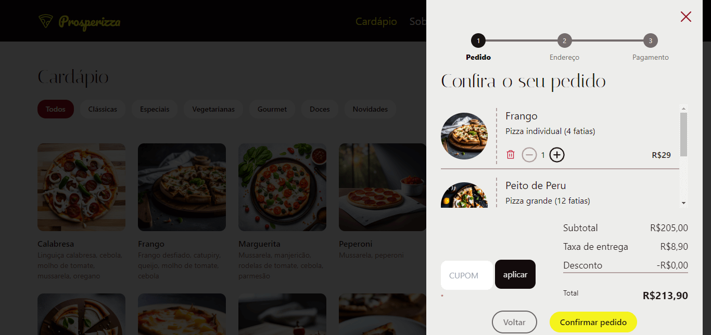
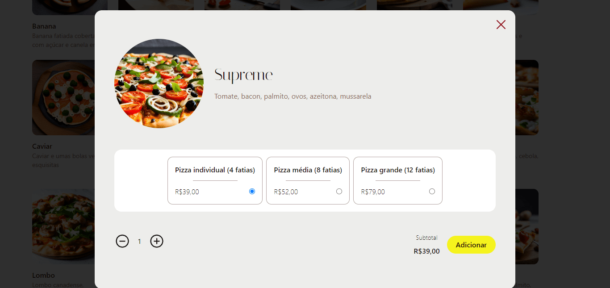

# Prosperizza

---

<a href="https://prosperizza.vercel.app/">🔗 Link</a>

---

## 📌 Sobre - Ponte para o mercado
Ponte é um programa de iniciativa da Prosper Tech, cujo objetivo é debloquear o potencial de cada aluna(o) no universo do React.js.

### Case Prático: Pizzaria

Trata-se de um sistema de pedido online para uma pizzaria utilizando React.js.

Este é um projeto que oferece a oportunidade de aplicar todos os conceitos desenvolvidos durante a trilha de aprendizado.

---

## 🔨 - Tecnologias utilizadas
- React
- Next.js 14
- MongoDB Atlas
- Mongoose
- Axios
- uuid
- ContextAPI
- TailwindCSS
- Phosphor icons
- Figma
- Git/ GitHub
- Vercel - Deploy
- IA Galileo para gerar imagens

---

## 🚀 - Preview

  

  

  

  

